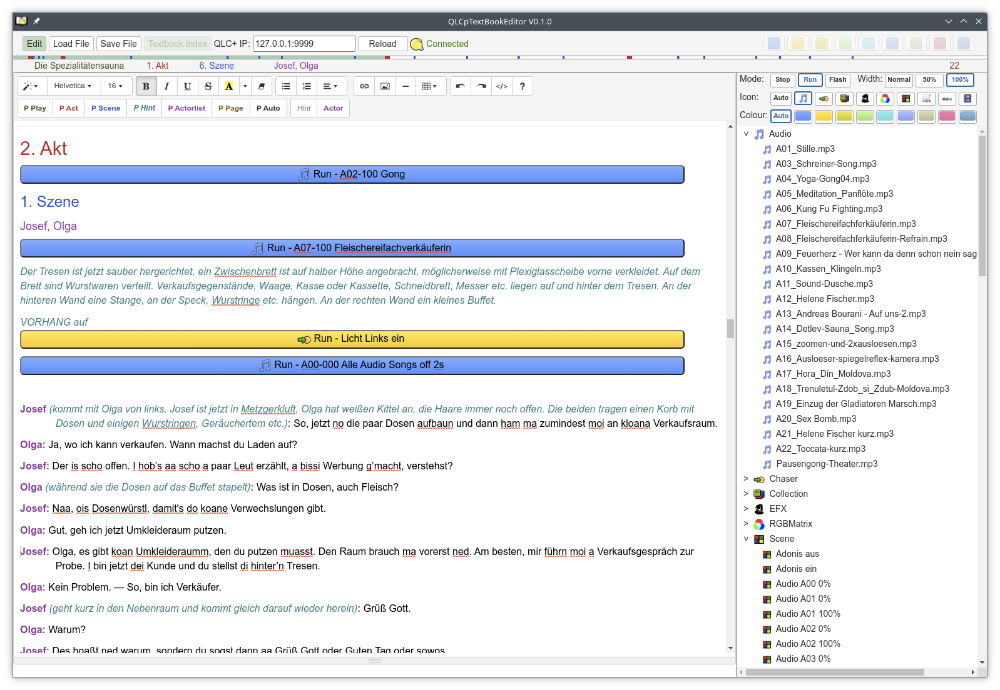

# qlcplus-textbook
An add on for QLC+ to start actions out of a (theatre) text document

With it you can scroll through a (HTLM) formated Text an place buttons which start/stop any kind of QLCplus actions.

**Installation**:

copy the "QLCpTextBook*" files and the folder "include" somewhere into the same directory then you can open the HTML file using a web browser (tested with Google-Chrome and FireFox). 

This Web-document uses some js libraries which are loaded automatically if your PC has Internet access. if your PC has temporarily no Internet you should run the QLCpTextBookLocalInstall.sh (Linux) or QLCpTextBookLocalInstall.bat (Windows) script, then all needed libraries are loaded into an "inclext" folder and you can run the textbook off line.

**Start**:

As mentioned you can load the "QLCpTextBook.html" into a web browser or if you have installed Chrome use the start script "QLCpTextBook.sh" (Linux) or "QLCpTextBook.bat" (Windows) with two advantages:

- It looks like an Application (Browser menu is removed)
- you can save the text book file somewhere on your PC by using a file-selector (with FireFox it is always "downloaded" into the download folder)

**Usage:**

The Application has two modes, "Edit" and "View", which can be selected by the `Edit` button. By default it start in the "View" mode.

When starting it also try to connect to the QLCplus web-socket interface at the local IP address (127.0.0.1). So you should start the QLCplus first and with the web interface activated by `qlcplus -w`. If you start QLCplus later or it is running on a different PC you can change the IP address and push the `Connect` button. Current status is displayed right of this button.

If you have already created an textbook file (stored as HTML) you can load it with the `Load File` button. *But only files stored with this application are accepted!* 

First start with the edit mode and press the `Edit` button.

Now you have on the left side the  [summernote](https://summernote.org/) editor area and on the right side the functions of [QLCplus](https://www.qlcplus.org/)

As summernote is a WYSIWYG editor using HTML formatting I have added some buttons for (my) needs to theatre text. Best is to copy/paste the text into the editor area. Be aware that copy can contain some HTML-formating which will disturb the format functions from summernote. If you have some strange behavior when formating the text first copy it into an text editor and paste it from there into summernote. Now you can format your text as you like. 

Description of the special format buttons (select the text area and press the button): 

| Button        | Description                                                  |
| ------------- | ------------------------------------------------------------ |
| `P Play`      | Paragraph with name of the play (use of HTML tag < h1 >)     |
| `P Act`       | Paragraph with act of the play (use of HTML tag < h2 >)      |
| `P Scene`     | Paragraph with scene of the act (use of HTML tag < h3 >)     |
| `P Hint`      | Paragraph with additional information how to play (use of HTML tag < p >) |
| `P Actorlist` | Paragraph with actors playing in this scene (use of HTML tag < h4 >) |
| `P Page`      | Page number of the paper text (use of HTML tag < h6 >)       |
| `P Auto`      | This can automatically format the text for a scene if the text follow this structure: - Actor name end with ":" - Hint text is in brackets "( ... )" - If there are only digits in a line it is interpreted as page number |
| `Hint`        | Format selected text for additional information  (use of HTML tag < i >) |
| `Actor`       | Format selected text for actor name  (use of HTML tag < b >) |

Based on this formatting you can see in the status line the current play, act, scene, actors (left) and page (right) information of the displayed text. Above this status line you can see a progress bar with marks for the act and scene when scrolling through the text.

If your text is nicely formatted you can add the QLCplus function-buttons into the text (right side of the editor) with this functionality:

| Mode    | Description                                                  |
| ------- | ------------------------------------------------------------ |
| `Stop`  | The fuction button will stop the QLCplus function            |
| `Run`   | The fuction button will start the QLCplus function           |
| `Flash` | The fuction button will start the QLCplus function and stop after 100ms (It is not the same as an QLCplus button in the virtual console with activated flash function) |

| Width    | Description                                                  |
| -------- | ------------------------------------------------------------ |
| `Normal` | The width of the button is based on the text inside the button |
| `50%`    | The button will be displayed in a width of 50% of the text view width |
| `100%`   | The button will be displayed with almost 100% of the text view width in a separate line |

| Icon                                                         | Description                                                  |
| ------------------------------------------------------------ | ------------------------------------------------------------ |
| `Auto`                                                       | Select the Icon displayed in the button based on the QLCplus function you select |
|  ...  | Select an Icon which is displayed in the button (no other functionality) |

| Colour           | Description (In view mode you can hide buttons with an dedicated colour) |
| ---------------- | ------------------------------------------------------------ |
| `Auto`           | Select the colour of the button based on the QLCplus function you select (the colour below the icon is used) |
| `<some colours>` | Select an colour for the button                              |

If you have checked your needed settings for the button you can point your text cursor to the wonted position and press on a QLCplus function to insert a button into your text. Be aware to select the correct cursor position because sometimes sommernote put it at the beginning of the text and create the button there ... but hitting `CTRL+Z` several times is your friend to remove an button. 

The button contains of the Mode, QLCplus function name and additional Text

BTW: 

- if you have selected some Text before you create the button, this text is placed then into the button.
- you can edit the text inside the button afterwards but you should do this only for the additional text
- If you rename the function in QLCplus the function names inside the buttons are updated if you press the `Reload` button (it is handled by the QLCplus id's)
- Even in the Edit-Mode the buttons are active and you can control the connected QLCplus application

Now you should save the text book file by pressing the `Save File` button

Back to the view mode by releasing the `Edit` button.

Here the functionality is much simpler, you can:

- scroll through the text with a mouse wheel, courser up/down, page up/down keys
- activate a sidebar with a list of act, scene and actorlist by pressing the `Textbook Index` button. You can click on a list item to scroll your text there
- Of course you can click on a fuction button to start/stop a QLCplus function.
- With the colour buttons you can hide the buttons in the text with the same colour

**Some additional information**

This Application has been programmed for my own need and "survived" the first live test in our [theater play](https://dorfbuehne-merching.de/). Before I was using some python script together with LibreOffice to create some HTML file to connect to QLCplus but it was a nightmare to create and change something. Now this app did more then I expected and I hope it could be helpful for someone else too.

All work and use is currently done on Linux with Chrome, so there could be some issues with other "systems". 

**Thanks to:**

​	QLCplus: https://github.com/mcallegari/qlcplus

​	Summernote: https://github.com/summernote/summernote
